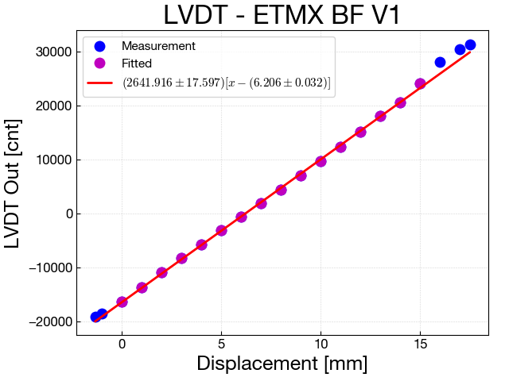

**Table of Contents**

[TOC]

# Calibration factors of LVDT 
この文書では、測定で得られたキャリブレーション係数がまとまっている。これら係数とMEDMに入っている係数を比較して、正しい値が実際の制御に使われているか確認をすることが目的。

しかし、キャリブレーション係数がWikiやklogに残っていないものもあったり、残っていてもMEDMの値と異なったりしている。これを整理すれば、この文書の目的は達成される。

## Calibration
Fitting voltage or count data with linear function around nominal position (0V or 0 count) as a function of the displacement. 

### Example




### Calibration factor

Calibration factor from count to micro meter is given by the fitted parameter above. We put the parameter b0 and b1 defined below into the gain and offset in the input filter bank, respectively.

```
y = b0*(x + b1)

y [um], 
x [cnt], 
b0 [um/cnt], 
b1 [cnt]
```

## Calibration factors
### ETMX
<font color='red'>If measured parameter and parameter on MEDM differ, the value is colored with red.</font>

| Item | b0 [um/cnt]<br> measured (MEDM)| b1 [cnt] <br> measured (MEDM)| Description |
| :--|:--|:--|:--|
| IP_H1 | -0.258 (-0.2582) | _ (0.0) | [1,5] |
| IP_H2 | -0.252 (-0.252) | _ (0.0) | [1,5] |
| IP_H3 | -0.232 (-0.233) | _ (0.0) | [1,5] |
| F0_GAS | -0.248 (<font color='red'>-0.172</font>) | _ (0.0) | [1,5] |
| F1_GAS | -0.223 (<font color='red'>-0.215</font>) | _ (+2000.0) | [1,3,5] |
| F2_GAS | -0.243 (-0.243) | _ (+2000.0) | [1,4,5] |
| F3_GAS | -0.225, (-0.2247) | _ (0) | [1,2,5] |
| BF_GAS | +0.204 (+0.2035) | _ (0) | [1,2,5] |
| BF_H1 | +0.406 (+0.406) | _ (0) | [1,2,5] |
| BF_H2 | +0.382 (<font color='red'>-0.3821</font>)| _ (0) | [1,2,5] |
| BF_H3 | +0.363 (<font color='red'>-0.3629</font>)| _ (0) | [1,2,5] |
| BF_V1 | +0.378 (<font color='red'>-0.379</font>)| _ (0) | [1,2,5] |
| BF_V2 | +0.385 (+0.385)| _ (0) | [1,2,5] |
| BF_V3 | +0.390 (+0.3902)| _ (0) | [1,2,5] |

1. http://gwwiki.icrr.u-tokyo.ac.jp/JGWwiki/KAGRA/Subgroups/VIS/TypeA/ETMX
2. http://klog.icrr.u-tokyo.ac.jp/osl/?r=3205
3. http://klog.icrr.u-tokyo.ac.jp/osl/?r=3330
4. http://klog.icrr.u-tokyo.ac.jp/osl/?r=3276
5. medm から 

### ETMY

| Item | b0 [um/cnt]<br> measured (MEDM)| b1 [cnt]<br> measured (MEDM)| Description |
| :--|:--|:--|:--|
| IP_H1 | <font color="Red">????</font> (-0.948) | , 0 | [4] |
| IP_H2 | <font color="Red">????</font> (+0.8497) | , 0 | [5,4] |
| IP_H3 | <font color="Red">????</font> (-0.1899) | , 0 | [5,4] |
| F0_GAS | <font color="Red">????</font> (-0.125) | _ (+1906.0) | [4] |
| F1_GAS | <font color="Red">????</font> (-0.661) | _ (-9688.0) | [4] |
| F2_GAS | +0.719 (+0.719) | _ (+6850.0) | [3,4] |
| F3_GAS | +1.52 (<font color="Red">-0.612</font>) | _ (-11762.0) | [2,4,5]|
| BF_GAS | -1.76 (<font color="Red">-0.883</font>) | _ (-10585.0) | [1,4,6]|
| BF_H1 | <font color="Red">????</font> (+0.488) | , -500.0 | [4]|
| BF_H2 | <font color="Red">????</font> (-0.476) | , +4135.0 | [4]|
| BF_H3 | <font color="Red">????</font> (+0.458) | , -2410.0 | [4]|
| BF_V1 | <font color="Red">????</font> (+0.409) | , +1871.0 | [4]|
| BF_V2 | <font color="Red">????</font> (+0.439) | , +1602.0 | [4]|
| BF_V3 | <font color="Red">????</font> (-0.385) | , -692.0 | [4]|

1. http://klog.icrr.u-tokyo.ac.jp/osl/?r=2499
2. http://klog.icrr.u-tokyo.ac.jp/osl/?r=2575
3. http://klog.icrr.u-tokyo.ac.jp/osl/?r=2665
4. MEDMから
5. Sensor range is +/- 2V.
6. Sensor range is +/- 1V.

### ITMX
| Item | b0 [um/cnt] <br> measured (MEDM)| b1 [cnt]<br> measured (MEDM)| Description |
| :--|:--|:--|:--|
| IP_H1 | <font color="Red">????</font> (+0.2987) | , 0 | [5,6] |
| IP_H2 | <font color="Red">????</font> (-0.1669) | , 0 | [5,6] |
| IP_H3 | <font color="Red">????</font> (+0.2323) | , 0 | [5,6] |
| F0_GAS | <font color="Red">????</font> (-0.22) | , 0 | [6] |
| F1_GAS | <font color="Red">????</font> (-0.18)| , 0 | [6] |
| F2_GAS | -0.77 (<font color='red'>-0.215</font>) | , 0 | [4,6,8] |
| F3_GAS | +0.958 (<font color='red'>+0.194</font>) | , 0 | [3,6,7]|
| BF_GAS | -0.629 (<font color='red'>-0.296</font>) | , 0 | [2,6,7] |
| BF_H1 | +0.371 (+0.371) | , 0 | [1,6]|
| BF_H2 | +0.381 (<font color='red'>-0.4396</font>)| , 0 | [1,6]|
| BF_H3 | +0.387 (<font color='red'>+0.4044</font>) | , 0 | [1,6]|
| BF_V1 | -0.354 (-0.354) | , 0 | [1,6]|
| BF_V2 | -0.367 (-0.367) | , 0 | [1,6]|
| BF_V3 | +0.385 (<font color='red'>-0.385</font>) | , 0 | [1,6]|

1. http://klog.icrr.u-tokyo.ac.jp/osl/?r=5002
2. http://klog.icrr.u-tokyo.ac.jp/osl/?r=4211
3. http://klog.icrr.u-tokyo.ac.jp/osl/?r=4257
4. http://klog.icrr.u-tokyo.ac.jp/osl/?r=4406
5. http://klog.icrr.u-tokyo.ac.jp/osl/?r=5131
6. Medm から
7. Sensor range is +/- 5V.
8. Sensor range is +/- 4V.


### ITMY
| Item | b0 [um/cnt]<br> measured (MEDM)| b1 [cnt]<br> measured (MEDM)| Description |
| :--|:--|:--|:--|
| IP_H1 | <font color="Red">????</font> (-0.2676) | _ (0) | [6] |
| IP_H2 | <font color="Red">????</font> (-0.2077) | _ (0) | [6] |
| IP_H3 | <font color="Red">????</font> (+0.2369) | _ (0) | [6] |
| F0_GAS | <font color="Red">????</font> (-0.3) | _ 0 | [6] |
| F1_GAS | -0.342 (-0.342) | _ (0) | [4,6] |
| F2_GAS | +0.951 (<font color="Red">+0.0979</font>) | _ (0) | [3,6,7] |
| F3_GAS | +0.219 (+0.21876) | _ (0) | [2,6,8]|
| BF_GAS | +0.452, (<font color="Red">+0.321</font>) | _ (0) | [1,6,8]|
| BF_H1 | -0.304 (-0.304) | _ (0) | [5,6] |
| BF_H2 | -0.337 (<font color="Red">+0.334</font>) | _ (0) | [5,6]|
| BF_H3 | -0.321 (-0.320) | _ (0) | [5,6]|
| BF_V1 | +0.373 (+0.374) | _ (0) | [5,6]|
| BF_V2 | -0.313 (<font color="Red">+0.313</font>) | _ (0) | [5,6]|
| BF_V3 | -0.323 (-0.323) | _ (0) | [5,6]|

1. http://klog.icrr.u-tokyo.ac.jp/osl/?r=5249
2. http://klog.icrr.u-tokyo.ac.jp/osl/?r=5325
3. http://klog.icrr.u-tokyo.ac.jp/osl/?r=5494
4. http://klog.icrr.u-tokyo.ac.jp/osl/?r=5587
5. http://klog.icrr.u-tokyo.ac.jp/osl/?r=5756
6. MEDMから
7.  [3]のグラフより、-2.5Vをノミナル位置として±1Vの線形範囲をもつことがわかる。この範囲での係数は0.951 [um/cnt]。だがmedmではは0V位置をノミナルにしているので、この係数は使えない。使うには0V付近でフィッティングした係数を使う必要あり。
8. Sensor range is +/- 5V.

### BS
| Item | b0 [um/cnt]<br> measured (MEDM)| b1 [cnt]<br> measured (MEDM)| Description |
| :--|:--|:--|:--|
| IP_H1 | _ (+0.327)  | _ (-1122.9) | |
| IP_H2 | _ (+0.299)  | _ (-1264.2) | |
| IP_H3 | _ (+0.396)  | _ (-868.5) | |
| F0_GAS | _ (+1.116)  | _ (+870.0) | |
| F1_GAS | _ (+0.771)  | _ (-1090.0) | |
| BF_GAS | _ (+0.427)  | _ (-350.0) | |

1. hoge

### SRM
| Item | b0 [um/cnt]<br> measured (MEDM)| b1 [cnt]<br> measured (MEDM)| Description |
| :--|:--|:--|:--|
| IP_H1 | _ (+0.294)  | _ (-373.0) | |
| IP_H2 | _ (+0.315)  | _ (-1253.0) | |
| IP_H3 | _ (+0.317)  | _ (-146.0) | |
| F0_GAS | _ (+0.185)  | _ (+2551.0) | |
| F1_GAS | _ (+0.141)  | _ (-4005.0) | |
| BF_GAS | _ (+0.156)  | _ (+2058.2) | |

1. hoge

### SR2
| Item | b0 [um/cnt]<br> measured (MEDM)| b1 [cnt]<br> measured (MEDM)| Description |
| :--|:--|:--|:--|
| IP_H1 | _ (+0.281)  | _ (+2057.0) | |
| IP_H2 | _ (+0.306)  | _ (-2552.0) | |
| IP_H3 | _ (+0.301)  | _ (-2022.0) | |
| F0_GAS | _ (+0.178)  | _ (-10214.0) | |
| F1_GAS | _ (+0.090)  | _ (-4740.0) | |
| BF_GAS | _ (+0.160)  | _ (+886.0) | |

1. hoge

### SR3
| Item | b0 [um/cnt]<br> measured (MEDM)| b1 [cnt]<br> measured (MEDM)| Description |
| :--|:--|:--|:--|
| IP_H1 | _ (+0.262)  | _ (-876.4) | |
| IP_H2 | _ (+0.240)  | _ (-877.8) | |
| IP_H3 | _ (+0.253)  | _ (-1188.6) | |
| F0_GAS | _ (+0.181)  | _ (-677.0) | |
| F1_GAS | _ (+0.088)  | _ (-1690.0) | |
| BF_GAS | _ (+0.055)  | _ (-5170.0) | |

1. hoge


### PRM
| Item | b0 [um/cnt]<br> measured (MEDM)| b1 [cnt]<br> measured (MEDM)| Description |
| :--|:--|:--|:--|
| BF_GAS | _ (+0.241)  | _ (0) | |
| SF_GAS | _ (+1.000)  | _ (0) | |
| BF_H1 | _ (-0.973)  | _ (0) | |
| BF_H2 | _ (-0.940)  | _ (0) | |
| BF_H3 | _ (-0.945)  | _ (0) | |
| BF_V1 |  _ (+0.941)  | _ (0) | |
| BF_V2 |  _ (-0.956)  | _ (0) | |
| BF_V3 |  _ (+0.954)  | _ (0) | |

1. hoge

### PR2
| Item | b0 [um/cnt]<br> measured (MEDM)| b1 [cnt]<br> measured (MEDM)| Description |
| :--|:--|:--|:--|
| SF_GAS | _ (-0.322)  | _ (0) | |
| BF_GAS | _ (+0.414)  | _ (0) | |
| BF_H1 | _ (+1.229)  | _ (+44.1) | |
| BF_H2 | _ (+1.250)  | _ (+419.2) | |
| BF_H3 | _ (-1.216)  | _ (+30.6) | |
| BF_V1 |  _ (-1.202)  | _ (+1103.5) | |
| BF_V2 |  _ (+1.229)  | _ (-516.7) | |
| BF_V3 |  _ (-1.224)  | _ (+142.9) | |

1. hoge

### PR3
| Item | b0 [um/cnt]<br> measured (MEDM)| b1 [cnt]<br> measured (MEDM)| Description |
| :--|:--|:--|:--|
| SF_GAS | _ (+0.337)  | _ (0) | |
| BF_GAS | _ (+0.342)  | _ (0) | |
| BF_H1 | _ (-1.658)  | _ (0) | |
| BF_H2 | _ (+1.645)  | _ (0) | |
| BF_H3 | _ (+1.681)  | _ (0) | |
| BF_V1 |  _ (+1.722)  | _ (0) | |
| BF_V2 |  _ (-1.730)  | _ (0) | |
| BF_V3 |  _ (+1.611)  | _ (0) | |

1. hoge


